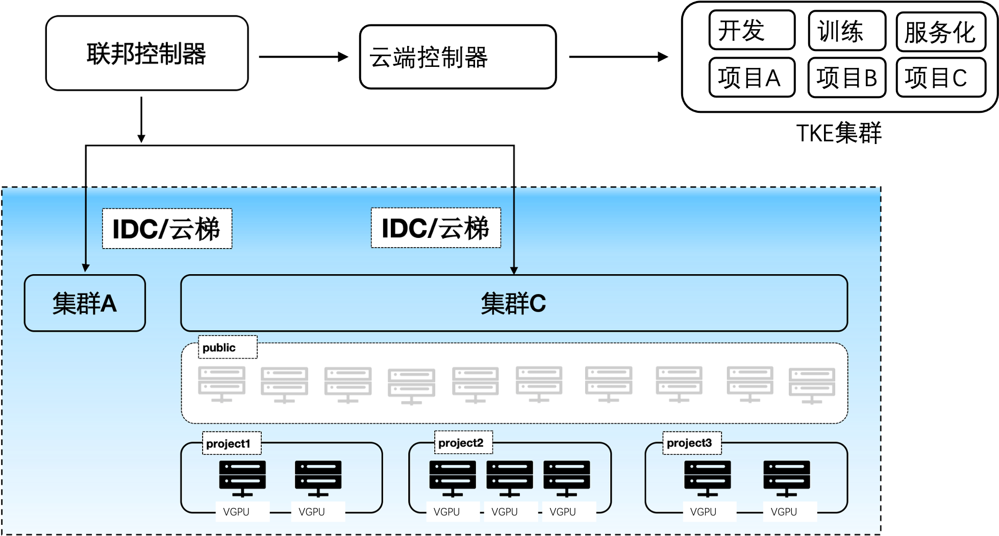
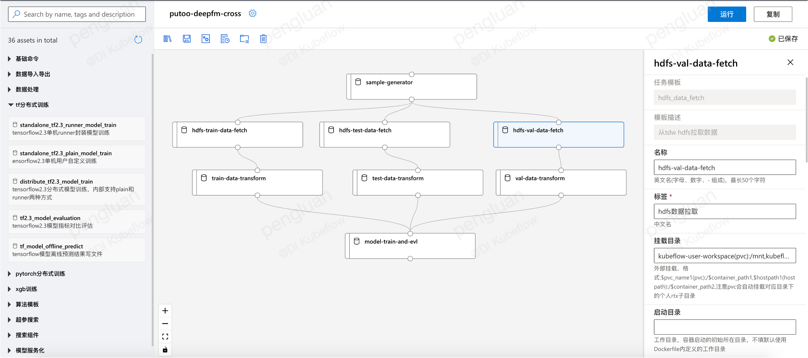
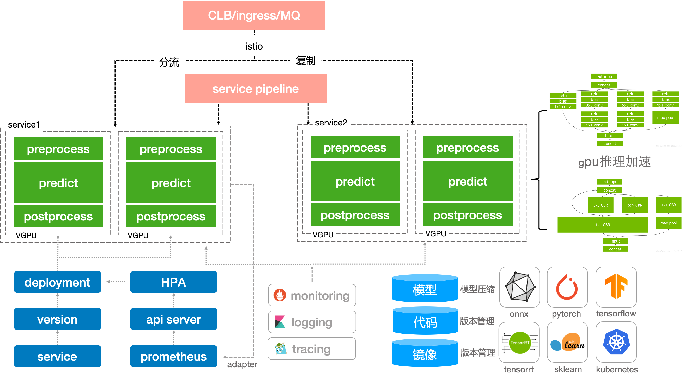

# TME Cube Studio
TME Cube Studio是由TME研发的集成数据处理、分布式计算、机器学习模型训练等多项功能的容器化算法平台, 帮助算法使用者提升算法迭代效率和共享度. Cube Studio包含多种组件, 支持TensorFlow、PyTorch等多种框架的分布式训练，自定义Pipeline构建等功能. 

# 开源共建

有意向进行开源共建的同学请微信添加767065521并备注"Cube Studio开源共建"进入微信群.

# 功能简述

整体架构

多集群管控

分布式存储

在线开发

拖拉拽pipeline编排、调试、单任务调试、监控、定时调度

功能模板化

nni超参搜索

分布式框架

推理服务

# 平台部署

参考install/README.md

平台完成部署之后如下:

